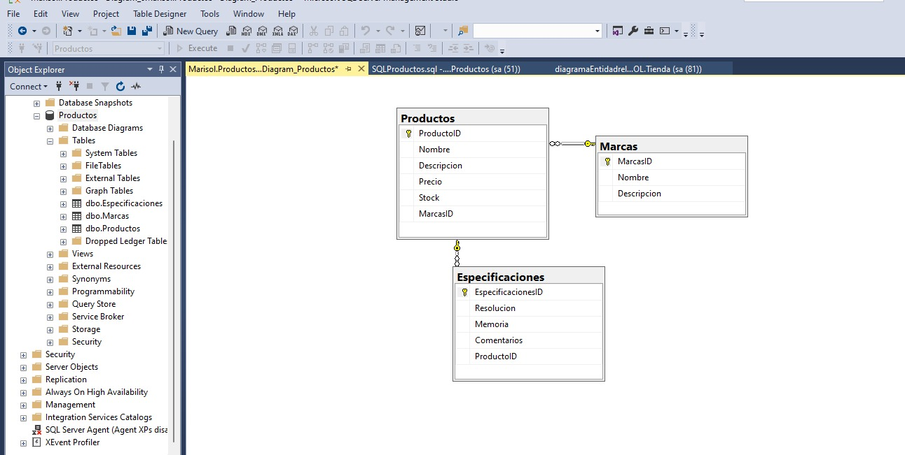

# DesarrolloFrontEnd
Descripcion: repositorio creado para la materia de desarrollo front end

# Para Ejecutar
Usar Visual Studio Code click derecho sobre el archivo index.html > De click a abrir con `Live Server`

# Esquema Entidad Relación

